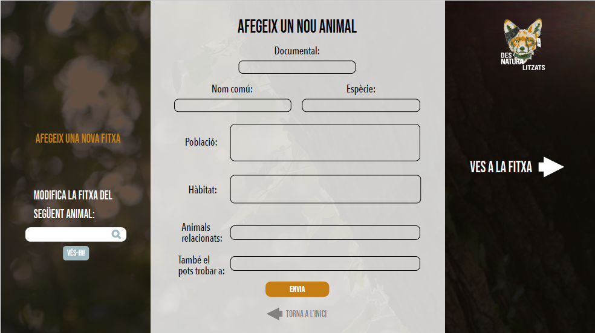

# Getting Started 

## Install and run the dependencies

### `TERMINAL`

- Run `npm` in **Animal-Cards** .
- Type cd **user-side** and, again, run `npm`.

*(if you work with yarn, type yarn instead npm).

## Data Base

### `TERMINAL`

- Type `mysql -u root- p` for acces to MySQL.
- Create a data base with the name : `AniamlCards`.

### `PROYECT`

- Add and env. file with this information inside:

DB_HOST=localhost
DB_USER=root
DB_PASS=root
DB_NAME=AnimalCards

### `TERMINAL`

- `npm`run migrate.
*(if you work with yarn, type yarn instead npm).

- The tables should look like this:

## Run start

### `TERMINAL`

- Type`npm` run start in **Animal-Cards** .
- Type cd **user-side** and, again, `npm` run start.

*(if you work with yarn, type yarn instead npm).

- Server directory: http://localhost:5000/
- Client directory: http://localhost:3000/

______________________________________________________________________________________________

# Briefing
The main **objective** of this project is to increase and complement the information of the animals and regions that appears in the Desnaturalitzats documentaries.

The app is divided in two parts: the **user** and the **admin** sides.

- `HOW THE USER SIDE LOOKS LIKE`
**missing** a view with the list of all the animals there are in each region.

- `HOW THE ADMIN SIDE LOOKS LIKE`
**missing** a view with the logging for acces to the admin options.

- `FLOW DIAGRAM`

### Done

- Data Base.
- Main view.
- Animal Card.
- Search view.

### To do

- Back end for the List view.
- The List View is not done (you have to change the information and work with the junction table).
- Api view and fetch.
- Add the button for swtich between user and admin sides.
- All the Admin side.

